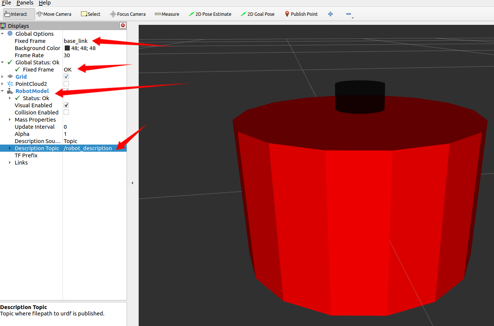
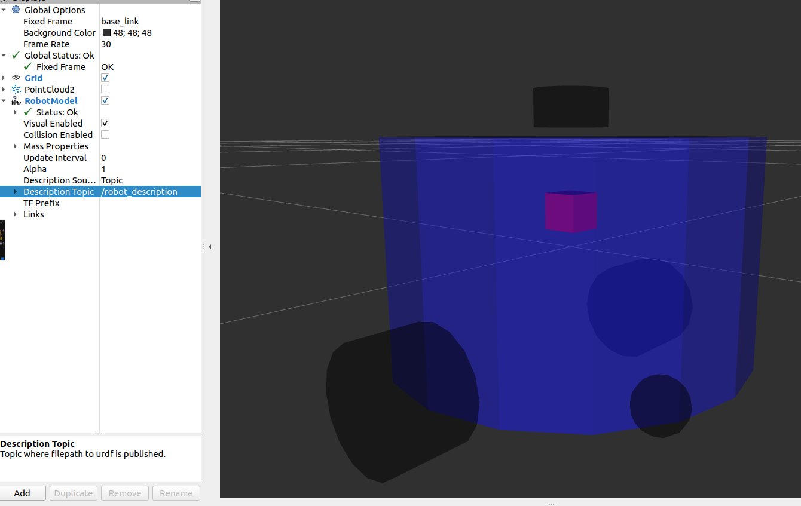
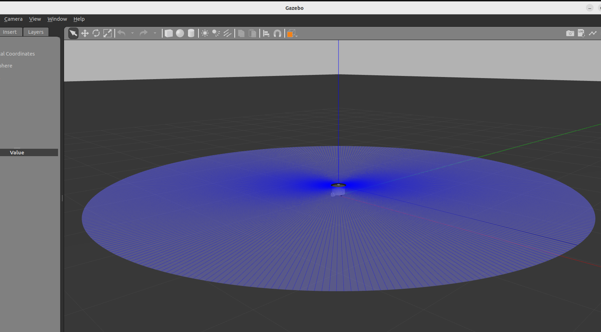

# 下载小鱼 仿真
```
git clone --recursive https://github.com/fishros/fishbot.git -b humble
cd fishbot
rosdep install --from-paths src -y
colcon build
```
> sudo rosdep init和rosdep update 是什么？

## 安装

安装起来很简单，一句话的事情，后面小鱼会让其变得更简单。
```
sudo pip install rosdepc# 如果显示没有pip可以试试pip3。
sudo pip3 install rosdepc# 如果pip3还没有

sudo apt-get
install python3-pip 
sudo pip install rosdepc
```

## 使用
```
sudo rosdepc init
rosdepc update
```
# 安装cartographer
```
sudo apt install ros-humble-cartographer ros-humble-cartographer-ros
ros2 pkg list | grep cartogrpaher
```
## 源码安装 cartographer
1. 将下面的源码克隆到fishbot_ws的src目录下：
```
git clone https://ghproxy.com/https://github.com/ros2/cartographer.git -b foxy
git clone https://ghproxy.com/https://github.com/ros2/cartographer_ros.git -b dashing
```
2. 一键配置rosdep
```
wget http://fishros.com/install -O fishros && . fishros

rosdepc install -r --from-paths src --ignore-src --rosdistro $ROS_DISTRO -y
```
3. 编译该包
```
colcon build --packages-up-to cartographer_ros
```

> rosdep install -i --from-path src --ignore-src -r
```xml
  <export>
    <build_type>ament_python</build_type>
  </export>
```


`rqt_graph`是一个可视化工具，可以显示节点和话题之间的关系图。以下是使用方法：

    启动rqt_graph：在终端输入以下命令可以启动rqt_graph工具： `ros2 run rqt_graph rqt_graph` 这将打开一个窗口，显示当前所有节点和话题的关系图

# 仿真FishBot
## 在launch创建diaplay_rviz2.launch.py
1. 
```xml
<?xml version="1.0"?>
<robot name="fishbot">
    
  <!-- base link -->
  <link name="base_link">
      <visual>
      <origin xyz="0 0 0.0" rpy="0 0 0"/>
      <geometry>
        <cylinder length="0.12" radius="0.10"/>
      </geometry>
    </visual>
  </link>
    
  <!-- laser link -->
  <link name="laser_link">
      <visual>
      <origin xyz="0 0 0" rpy="0 0 0"/>
      <geometry>
        <cylinder length="0.02" radius="0.02"/>
      </geometry>
      <material name="black">
          <color rgba="0.0 0.0 0.0 0.8" /> 
      </material>
    </visual>
  </link>
    
  <!-- laser joint -->
    <joint name="laser_joint" type="fixed">
        <parent link="base_link" />
        <child link="laser_link" />
        <origin xyz="0 0 0.075" />
    </joint>

</robot>
```



2. 
```xml
<?xml version="1.0"?>
<robot name="fishbot">
    
  <!-- base link -->
  <link name="base_link">
  	<visual>
      <origin xyz="0 0 0.0" rpy="0 0 0"/>
      <geometry>
		<cylinder length="0.12" radius="0.10"/>
      </geometry>
      <material name="blue">
      	<color rgba="0.1 0.1 1.0 0.5" /> 
      </material>
    </visual>
  </link>
    
  <!-- laser link -->
  <link name="laser_link">
  	<visual>
      <origin xyz="0 0 0" rpy="0 0 0"/>
      <geometry>
		<cylinder length="0.02" radius="0.02"/>
      </geometry>
      <material name="black">
      	<color rgba="0.0 0.0 0.0 0.5" /> 
      </material>
    </visual>
  </link>
    
  <!-- laser joint -->
  <joint name="laser_joint" type="fixed">
      <parent link="base_link" />
      <child link="laser_link" />
      <origin xyz="0 0 0.075" />
  </joint>

  <link name="imu_link">
  	<visual>
      <origin xyz="0 0 0.0" rpy="0 0 0"/>
      <geometry>
		    <box size="0.02 0.02 0.02"/>
      </geometry>
    </visual>
  </link>

  <!-- imu joint -->
  <joint name="imu_joint" type="fixed">
      <parent link="base_link" />
      <child link="imu_link" />
      <origin xyz="0 0 0.02" />
  </joint>


  <link name="left_wheel_link">
      <visual>
        <origin xyz="0 0 0" rpy="1.57079 0 0"/>
        <geometry>
          <cylinder length="0.04" radius="0.032"/>
        </geometry>
          <material name="black">
            <color rgba="0.0 0.0 0.0 0.5" /> 
          </material>
      </visual>
  </link>
    
  <joint name="left_wheel_joint" type="continuous">
      <parent link="base_link" />
      <child link="left_wheel_link" />
      <origin xyz="-0.02 0.10 -0.06" />
      <axis xyz="0 1 0" />
  </joint>

  <link name="right_wheel_link">
      <visual>
        <origin xyz="0 0 0" rpy="1.57079 0 0"/>
        <geometry>
          <cylinder length="0.04" radius="0.032"/>
        </geometry>
          <material name="black">
            <color rgba="0.0 0.0 0.0 0.5" /> 
          </material>
      </visual>
  </link>
    
  <joint name="right_wheel_joint" type="continuous">
      <parent link="base_link" />
      <child link="right_wheel_link" />
      <origin xyz="-0.02 -0.10 -0.06" />
      <axis xyz="0 1 0" />
  </joint>

  <link name="caster_link">
    <visual>
      <origin xyz="0 0 0" rpy="1.57079 0 0"/>
      <geometry>
          <sphere radius="0.016"/>
      </geometry>
        <material name="black">
          <color rgba="0.0 0.0 0.0 0.5" /> 
        </material>
    </visual>
  </link>
    
  <joint name="caster_joint" type="fixed">
      <parent link="base_link" />
      <child link="caster_link" />
      <origin xyz="0.06 0.0 -0.076" />
      <axis xyz="0 1 0" />
  </joint>


</robot>
```

3. 
```python
import os
from launch import LaunchDescription
from launch.substitutions import LaunchConfiguration
from launch_ros.actions import Node
from launch_ros.substitutions import FindPackageShare


def generate_launch_description():
    package_name = 'fishbot_description'
    urdf_name = "fishbot_base.urdf"

    ld = LaunchDescription()
    pkg_share = FindPackageShare(package=package_name).find(package_name) 
    urdf_model_path = os.path.join(pkg_share, f'urdf/{urdf_name}')

    robot_state_publisher_node = Node(
        package='robot_state_publisher',
        executable='robot_state_publisher',
        arguments=[urdf_model_path]
        )

    joint_state_publisher_node = Node(
        package='joint_state_publisher_gui',
        executable='joint_state_publisher_gui',
        name='joint_state_publisher_gui',
        arguments=[urdf_model_path]
        )

    rviz2_node = Node(
        package='rviz2',
        executable='rviz2',
        name='rviz2',
        output='screen',
        )

    ld.add_action(robot_state_publisher_node)
    ld.add_action(joint_state_publisher_node)
    ld.add_action(rviz2_node)

    return ld

```
> 运行
```
colcon build
source install/setup.bash
ros2 launch fishbot_description display_rviz2.launch.py
```

## 在launch创建diaplay_gazebo.launch.py
```python
import os
from launch import LaunchDescription
from launch.actions import ExecuteProcess
from launch_ros.actions import Node
from launch_ros.substitutions import FindPackageShare


def generate_launch_description():
    robot_name_in_model = 'fishbot'
    package_name = 'fishbot_description'
    urdf_name = "fishbot_gazebo.urdf"

    ld = LaunchDescription()
    pkg_share = FindPackageShare(package=package_name).find(package_name) 
    urdf_model_path = os.path.join(pkg_share, f'urdf/{urdf_name}')

    # Start Gazebo server
    start_gazebo_cmd =  ExecuteProcess(
        cmd=['gazebo', '--verbose','-s', 'libgazebo_ros_init.so', '-s', 'libgazebo_ros_factory.so'],
        output='screen')

    # Launch the robot
    spawn_entity_cmd = Node(
        package='gazebo_ros', 
        executable='spawn_entity.py',
        arguments=['-entity', robot_name_in_model,  '-file', urdf_model_path ], output='screen')

    ld.add_action(start_gazebo_cmd)
    ld.add_action(spawn_entity_cmd)


    return ld

```
> 运行
```
colcon build --packages-select fishbot_description
source install/setup.bash
ros2 launch fishbot_description diaplay_gazebo.launch.py
```
> urdf
```xml
<?xml version="1.0"?>
<robot name="fishbot">


  <!-- Robot Footprint -->
  <link name="base_footprint"/>

  <joint name="base_joint" type="fixed">
    <parent link="base_footprint"/>
    <child link="base_link"/>
    <origin xyz="0.0 0.0 0.076" rpy="0 0 0"/>
  </joint>


  <!-- base link -->
  <link name="base_link">
  	<visual>
      <origin xyz="0 0 0.0" rpy="0 0 0"/>
      <geometry>
		<cylinder length="0.12" radius="0.10"/>
      </geometry>
      <material name="blue">
      	<color rgba="0.1 0.1 1.0 0.5" /> 
      </material>
    </visual>
    <collision>
      <origin xyz="0 0 0.0" rpy="0 0 0"/>
      <geometry>
		<cylinder length="0.12" radius="0.10"/>
      </geometry>
      <material name="blue">
      	<color rgba="0.1 0.1 1.0 0.5" /> 
      </material>
    </collision>
    <inertial>
      <mass value="0.2"/>
      <inertia ixx="0.0122666" ixy="0" ixz="0" iyy="0.0122666" iyz="0" izz="0.02"/>
    </inertial>
  </link>
    
  <!-- laser link -->
  <link name="laser_link">
    <visual>
      <origin xyz="0 0 0" rpy="0 0 0"/>
      <geometry>
        <cylinder length="0.02" radius="0.02"/>
      </geometry>
      <material name="black">
        <color rgba="0.0 0.0 0.0 0.5" /> 
      </material>
    </visual>
    <collision>
      <origin xyz="0 0 0" rpy="0 0 0"/>
      <geometry>
        <cylinder length="0.02" radius="0.02"/>
      </geometry>
      <material name="black">
        <color rgba="0.0 0.0 0.0 0.5" /> 
      </material>
    </collision>
    <inertial>
    <mass value="0.1"/>
      <inertia ixx="0.000190416666667" ixy="0" ixz="0" iyy="0.0001904" iyz="0" izz="0.00036"/>
    </inertial>
  </link>
  
  <!-- laser joint -->
  <joint name="laser_joint" type="fixed">
      <parent link="base_link" />
      <child link="laser_link" />
      <origin xyz="0 0 0.075" />
  </joint>

  <link name="imu_link">
  	<visual>
      <origin xyz="0 0 0.0" rpy="0 0 0"/>
      <geometry>
		    <box size="0.02 0.02 0.02"/>
      </geometry>
    </visual>
    <collision>
      <origin xyz="0 0 0.0" rpy="0 0 0"/>
      <geometry>
		    <box size="0.02 0.02 0.02"/>
      </geometry>
    </collision>
    <inertial>
      <mass value="0.1"/>
        <inertia ixx="0.000190416666667" ixy="0" ixz="0" iyy="0.0001904" iyz="0" izz="0.00036"/>
      </inertial>
  </link>

  <!-- imu joint -->
  <joint name="imu_joint" type="fixed">
      <parent link="base_link" />
      <child link="imu_link" />
      <origin xyz="0 0 0.02" />
  </joint>


  <link name="left_wheel_link">
      <visual>
        <origin xyz="0 0 0" rpy="1.57079 0 0"/>
        <geometry>
          <cylinder length="0.04" radius="0.032"/>
        </geometry>
          <material name="black">
            <color rgba="0.0 0.0 0.0 0.5" /> 
          </material>
      </visual>
      <collision>
        <origin xyz="0 0 0" rpy="1.57079 0 0"/>
        <geometry>
          <cylinder length="0.04" radius="0.032"/>
        </geometry>
          <material name="black">
            <color rgba="0.0 0.0 0.0 0.5" /> 
          </material>
      </collision>
      <inertial>
        <mass value="0.2"/>
          <inertia ixx="0.000190416666667" ixy="0" ixz="0" iyy="0.0001904" iyz="0" izz="0.00036"/>
        </inertial>
  </link>
    
  <link name="right_wheel_link">
      <visual>
        <origin xyz="0 0 0" rpy="1.57079 0 0"/>
        <geometry>
          <cylinder length="0.04" radius="0.032"/>
        </geometry>
          <material name="black">
            <color rgba="0.0 0.0 0.0 0.5" /> 
          </material>
      </visual>
      <collision>
        <origin xyz="0 0 0" rpy="1.57079 0 0"/>
        <geometry>
          <cylinder length="0.04" radius="0.032"/>
        </geometry>
          <material name="black">
            <color rgba="0.0 0.0 0.0 0.5" /> 
          </material>
      </collision>
      <inertial>
      <mass value="0.2"/>
      <inertia ixx="0.000190416666667" ixy="0" ixz="0" iyy="0.0001904" iyz="0" izz="0.00036"/>
    </inertial>
  </link>
    
  <joint name="left_wheel_joint" type="continuous">
      <parent link="base_link" />
      <child link="left_wheel_link" />
      <origin xyz="-0.02 0.10 -0.06" />
      <axis xyz="0 1 0" />
  </joint>

  <joint name="right_wheel_joint" type="continuous">
      <parent link="base_link" />
      <child link="right_wheel_link" />
      <origin xyz="-0.02 -0.10 -0.06" />
      <axis xyz="0 1 0" />
  </joint>

  <link name="caster_link">
      <visual>
        <origin xyz="0 0 0" rpy="1.57079 0 0"/>
        <geometry>
            <sphere radius="0.016"/>
        </geometry>
          <material name="black">
            <color rgba="0.0 0.0 0.0 0.5" /> 
          </material>
      </visual>
      <collision>
        <origin xyz="0 0 0" rpy="1.57079 0 0"/>
        <geometry>
            <sphere radius="0.016"/>
        </geometry>
          <material name="black">
            <color rgba="0.0 0.0 0.0 0.5" /> 
          </material>
      </collision>
      <inertial>
      <mass value="0.02"/>
      <inertia ixx="0.000190416666667" ixy="0" ixz="0" iyy="0.0001904" iyz="0" izz="0.00036"/>
    </inertial>
  </link>
    
  <joint name="caster_joint" type="fixed">
      <parent link="base_link" />
      <child link="caster_link" />
      <origin xyz="0.06 0.0 -0.076" />
      <axis xyz="0 1 0" />
  </joint>


  <gazebo reference="caster_link">
    <material>Gazebo/Black</material>
  </gazebo>

  <gazebo reference="caster_link">
    <mu1 value="0.0"/>
    <mu2 value="0.0"/>
    <kp value="1000000.0" />
    <kd value="10.0" />
  </gazebo>


  <gazebo>
    <plugin name='diff_drive' filename='libgazebo_ros_diff_drive.so'>
          <ros>
            <namespace>/</namespace>
            <remapping>cmd_vel:=cmd_vel</remapping>
            <remapping>odom:=odom</remapping>
          </ros>
          <update_rate>30</update_rate>
          <!-- wheels -->
          <left_joint>left_wheel_joint</left_joint>
          <right_joint>right_wheel_joint</right_joint>
          <!-- kinematics -->
          <wheel_separation>0.2</wheel_separation>
          <wheel_diameter>0.065</wheel_diameter>
          <!-- limits -->
          <max_wheel_torque>20</max_wheel_torque>
          <max_wheel_acceleration>1.0</max_wheel_acceleration>
          <!-- output -->
          <publish_odom>true</publish_odom>
          <publish_odom_tf>true</publish_odom_tf>
          <publish_wheel_tf>true</publish_wheel_tf>
          <odometry_frame>odom</odometry_frame>
          <robot_base_frame>base_footprint</robot_base_frame>
      </plugin>
    </gazebo> 

    <gazebo reference="imu_link">
      <sensor name="imu_sensor" type="imu">
      <plugin filename="libgazebo_ros_imu_sensor.so" name="imu_plugin">
          <ros>
            <namespace>/</namespace>
            <remapping>~/out:=imu</remapping>
          </ros>
          <initial_orientation_as_reference>false</initial_orientation_as_reference>
        </plugin>
        <always_on>true</always_on>
        <update_rate>100</update_rate>
        <visualize>true</visualize>
        <imu>
          <angular_velocity>
            <x>
              <noise type="gaussian">
                <mean>0.0</mean>
                <stddev>2e-4</stddev>
                <bias_mean>0.0000075</bias_mean>
                <bias_stddev>0.0000008</bias_stddev>
              </noise>
            </x>
            <y>
              <noise type="gaussian">
                <mean>0.0</mean>
                <stddev>2e-4</stddev>
                <bias_mean>0.0000075</bias_mean>
                <bias_stddev>0.0000008</bias_stddev>
              </noise>
            </y>
            <z>
              <noise type="gaussian">
                <mean>0.0</mean>
                <stddev>2e-4</stddev>
                <bias_mean>0.0000075</bias_mean>
                <bias_stddev>0.0000008</bias_stddev>
              </noise>
            </z>
          </angular_velocity>
          <linear_acceleration>
            <x>
              <noise type="gaussian">
                <mean>0.0</mean>
                <stddev>1.7e-2</stddev>
                <bias_mean>0.1</bias_mean>
                <bias_stddev>0.001</bias_stddev>
              </noise>
            </x>
            <y>
              <noise type="gaussian">
                <mean>0.0</mean>
                <stddev>1.7e-2</stddev>
                <bias_mean>0.1</bias_mean>
                <bias_stddev>0.001</bias_stddev>
              </noise>
            </y>
            <z>
              <noise type="gaussian">
                <mean>0.0</mean>
                <stddev>1.7e-2</stddev>
                <bias_mean>0.1</bias_mean>
                <bias_stddev>0.001</bias_stddev>
              </noise>
            </z>
          </linear_acceleration>
        </imu>
      </sensor>
    </gazebo>

  <gazebo reference="laser_link">
      <sensor name="laser_sensor" type="ray">
      <always_on>true</always_on>
      <visualize>true</visualize>
      <update_rate>10</update_rate>
      <pose>0 0 0.075 0 0 0</pose>
      <ray>
          <scan>
            <horizontal>
              <samples>360</samples>
              <resolution>1.000000</resolution>
              <min_angle>0.000000</min_angle>
              <max_angle>6.280000</max_angle>
            </horizontal>
          </scan>
          <range>
            <min>0.120000</min>
            <max>3.5</max>
            <resolution>0.015000</resolution>
          </range>
          <noise>
            <type>gaussian</type>
            <mean>0.0</mean>
            <stddev>0.01</stddev>
          </noise>
      </ray>

      <plugin name="laserscan" filename="libgazebo_ros_ray_sensor.so">
        <ros>
          <remapping>~/out:=scan</remapping>
        </ros>
        <output_type>sensor_msgs/LaserScan</output_type>
        <frame_name>laser_link</frame_name>
      </plugin>
      </sensor>
    </gazebo>

</robot>
```


## 最终
在URDF添加`base_link`、`diff_drive`、`imu_link`、`laser_link`

```
ros2 launch fishbot_description diaplay.launch.py
```


# cmd_val
```
sudo apt install ros-humble-teleop-twist-keyboard
ros2 run teleop_twist_keyboard teleop_twist_keyboard
```
> `rqt`怎么还有call

# 为FishBot配置Nav2
```
ros2 pkg create fishbot_navigation2 --dependencies nav2_bringup
```